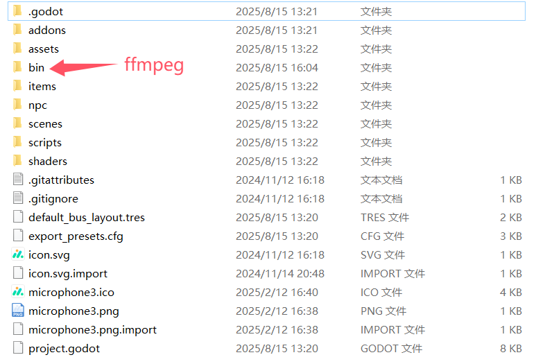
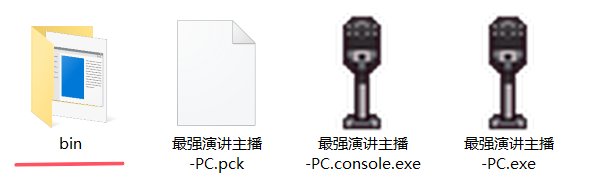
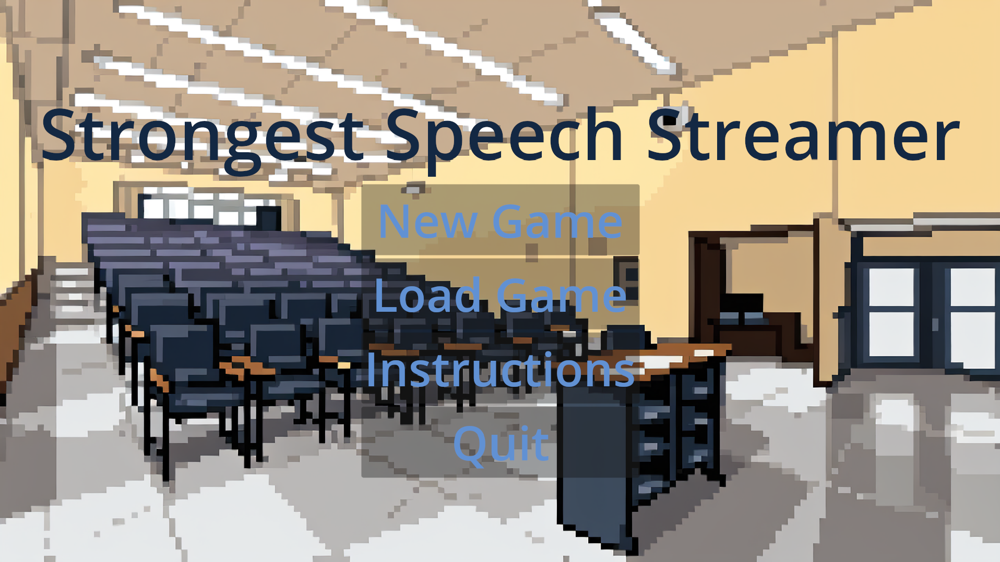
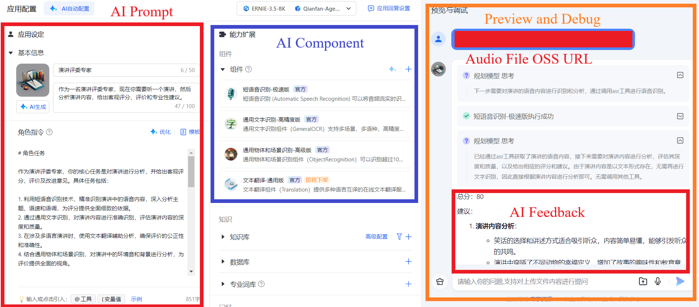

# Strongest Speech Streamer / 最强演讲主播

**A Godot 4.3-based gamified speech training platform providing AI feedback for formal speech practice.**  
**基于 Godot 4.3 的游戏化演讲训练平台，提供 AI 语音反馈，帮助正式演讲练习。**

---

## Table of Contents / 目录

- [Project Overview / 项目概览](#project-overview--项目概览)  
- [Functional Modules / 功能模块](#functional-modules--功能模块)  
- [Requirements / 运行环境要求](#requirements--运行环境要求)  
- [Setup & Deployment / 安装与部署](#setup--deployment--安装与部署)
- [Notes on Source Code / 源码说明](#notes-on-source-code--源码说明)  
- [Usage / 使用说明](#usage--使用说明)  
- [License / 许可证](#license--许可证)  

---

## Project Overview / 项目概览

Strongest Speech Streamer is an AI-driven gamified speech training platform designed for primary school students. Players become "streamers" in a virtual broadcasting company, improving their speech skills through interactive scenarios while receiving instant analysis on pacing, fluency, and content organization.  

最强演讲主播是一款面向中小学生的 AI 游戏化演讲训练平台。玩家在虚拟广播公司中扮演“主播”，通过互动场景提升演讲技能，同时获得语速、流利度和内容组织的即时分析。

---

## Functional Modules / 功能模块

| Module / 模块 | Description / 描述 |
|---------------|------------------|
| Gamification System / 游戏化系统 | Role-playing, rewards, punishment, social features, and mini-games. / 角色扮演、奖励机制、惩罚机制、社交功能及小游戏。 |
| Speech Training Modules / 演讲训练模块 | Theory learning, practice sessions, skill drills, and adaptive difficulty. / 理论学习、练习环节、技能训练及难度自适应。 |
| AI Feedback Engine / AI 反馈引擎 | Real-time analysis, multidimensional reports, semantic feedback via LLM, audio processing with FFmpeg, storage on Alibaba OSS. / 实时分析、多维度报告，利用 LLM 提供语义反馈，FFmpeg 处理音频，数据存储于阿里云 OSS。 |
| Technical Implementation / 技术实现 | Speech rate detection algorithm, voice-driven gameplay, cross-platform support(Windows / Android). / 语速检测算法、语音驱动游戏、跨平台支持（Windows / Android）。 |

---

## Requirements / 运行环境要求

- Godot Engine 4.3
- Platforms: Windows / Linux / Android (tested on Android 12)  
- Microphone access for speech capture

- Godot Engine 4.3  
- 平台：Windows / Linux / Android（已在 Android 12 测试）  
- 麦克风权限（用于语音采集）

### Minimum Hardware Requirements / 最低硬件配置要求

- **PC:**  
  CPU: Intel i5 or equivalent / CPU: i5 或同级别  
  RAM: 4 GB / 内存 4GB  
  OS: Windows 10 or later / 操作系统 Windows 10 以上  
  Microphone: Standard / 标准麦克风  

- **Android:**  
  OS: Android 12 or later / Android 12 以上  
  CPU: Quad-core 2.0 GHz or higher / CPU 四核 2.0GHz 或以上  
  RAM: 4 GB / 内存 4GB  
  Microphone: Standard / 标准麦克风
---

## Setup & Deployment / 安装与部署

### 1.Download Project Files / 下载项目文件

- Download the Godot source project (only the AI gamified version “Strongest Speech Streamer”) and the four versions of executable files (PC & Android, gamified AI and Speech Learning Tool).  
- 下载 Godot 源代码工程（仅包含 AI 游戏化版本“最强演讲主播”的源码）以及四个版本的可执行文件（PC/Android 端，“最强演讲主播”和“演讲学习工具”）。
- Due to GitHub file size limitations, executable files and the PC ffmpeg file are hosted on a cloud drive for download: [Download Link](https://pan.baidu.com/s/1o2qi9rAzwodceS_mP8JbYg?pwd=qm3m)
- 由于 GitHub 仓库文件大小限制，可执行文件及 PC 端 ffmpeg 文件已放在网盘供下载：[下载链接](https://pan.baidu.com/s/1o2qi9rAzwodceS_mP8JbYg?pwd=qm3m)

### 2.Open Godot Project / 打开 Godot 源代码工程

- Install **Godot Engine 4.3 stable**  
- Launch Godot → Import → Import Existing Project → select the downloaded project folder
- 安装 **Godot Engine 4.3 stable**
- 启动 Godot → 导入 → 导入现有项目 → 选择下载的项目文件夹。

### 3.Run in Editor / 编辑器中运行

- Open the main scene → Press **Play Scene (F5)**  
- Test all features: speech capture, AI feedback, record panel, course links
- 打开主场景 → 按 **F5** 运行。
- 测试所有功能：语音采集、AI 反馈、记录面板、课程链接。

### 4.Export Project / 导出项目

- Project → Export → choose target platform (Windows / Android)  
- Configure export options → Export  
- Run the exported executable or APK
- 项目 → 导出 → 选择目标平台（Windows / Android）
- 配置导出选项 → 导出。
- 运行导出的可执行文件或 APK。
---
## Usage / 使用说明
1. **PC Version / PC端使用**
   - Before using on PC, please make sure the project contains the file `/bin/ffmpeg.exe`. If it does not exist, please download it and place the `bin` folder under the project directory.  
   - 使用 PC 端之前，请确认工程文件中是否存在 `/bin/ffmpeg.exe`。若不存在，请下载，并将 `bin` 文件夹放入工程文件下。
     <div align="center">
     
     </div>
2. **Android Version / 安卓端使用**
   - Before using on Android, please make sure the project contains the folder `/addons/ffmpeg`. If it does not exist, please re-download it and place the `ffmpeg` folder under the project directory.  
   - 使用安卓端之前，请确认工程文件中是否存在 `/addons/ffmpeg` 文件夹。若不存在，请重新下载，并将 `ffmpeg` 文件夹放入工程文件下。  
3. **Exported Executable / 导出游戏可执行文件**
   - When exporting the game executable (.exe), `ffmpeg.exe` may not be included in the package.Please place the `bin` folder in the same directory as the exported executable.  
   - 导出游戏可执行文件 (.exe) 时，`ffmpeg.exe` 可能不会被打包。请将 `bin` 文件夹放入游戏可执行文件 (.exe) 的同目录下。
     <div align="center">
     
     </div>
---
## Notes on Source Code / 源码说明
1. **Language / 语言说明**
   - The provided source code is primarily in Chinese (UI and in-game text). Only certain scenes in the demo version were localized into English to illustrate the overall core workflow of the game and the AI feedback.
   - 提供的源码主要为中文界面和文本。演示版本中仅部分场景英文化，用于展示游戏的大致核心流程与 AI 反馈效果。
2. **Replicability / 可复现性**
   - Researchers can run the game and inspect all functional modules, algorithms, and AI feedback processes directly from the Chinese source code. All core gameplay logic, AI integration, and audio processing are fully accessible.
   - 研究人员可直接运行中文源码，查看所有功能模块、算法以及 AI 反馈流程。核心游戏逻辑、AI 集成及音频处理完全开放。
3. **Demo / 演示**
- #### Strongest Speech Streamer / 最强演讲主播
   
   A Strongest Speech Streamer demo version is provided in the video to illustrate the core gameplay. For an English UI, users can modify the .tscn scene files or scripts to localize the interface. Click the image below to watch the demo video.
   视频中提供了最强演讲主播游戏演示版本，仅用于展示游戏核心玩法。如需英文界面，可自行修改 .tscn 场景文件或脚本实现界面本地化。点击下方图片观看演示视频。
     <p align="center">
       <a href="https://youtu.be/0PGKH4IYjng?si=F-xLGsXWaW0Ac8zA">
         
       </a>
     </p>
	 
- #### Speech Learning Tool / 演讲学习工具

	A demo version of the Speech Learning Tool is provided to illustrate the traditional learning method used as the control group. .
	演示了演讲学习工具的使用，展示了传统学习方法（作为对照组）的核心流程。

4. **AI Feedback System / AI 反馈系统说明**
   
    The game integrates an AI feedback system to analyze players' speech performance, including pacing, fluency, and content organization, and to provide improvement suggestions. The AI component in this project is implemented using **Baidu AI Cloud Qianfan AppBuilder** platform with pre-trained models such as **ERNIE-3.5-8K** and **Qianfan-Agent-Speed-8K**.
     No model retraining was performed. Instead, the project leverages custom prompts within AppBuilder to guide the AI in providing feedback aligned with the teaching objectives. This allows researchers to   understand the AI workflow and replicate the feedback process without requiring access to private user data or model training.

    游戏中集成了 AI 反馈系统，用于分析玩家的演讲表现，包括语速、流利度和内容组织，并提供改进建议。本项目中的 AI 部分通过 **百度智能云千帆 AppBuilder** 平台 实现，调用预训练模型，如 **ERNIE-3.5-8K** 和 **Qianfan-Agent-Speed-8K**。
     项目中未对模型进行再训练，而是通过在 AppBuilder 平台中编写 自定义 Prompt，指导 AI 提供符合教学目标的反馈。这使研究人员能够理解 AI 的工作流程并复现反馈过程，而无需访问用户私密数据或重新训练模型。

   <div align="center">
	   
   </div>

    In the project files, researchers can replace the AI model by modifying the API configuration in `project/scripts/main.gd`. This allows testing with different models while keeping the feedback workflow intact.
   
     在工程项目文件中，研究人员可以通过修改 `project/scripts/main.gd` 中的 API 配置来更换 AI 模型，从而测试不同模型的反馈效果，同时保持原有反馈流程不变。
   

### AI Functions in main.gd / main.gd 中的 AI 函数

```gdscript
# Initialize a new AI conversation session
func create():
	var url := "https://qianfan.baidubce.com/v2/app/conversation" # API URL
	var body := {"app_id": "YOUR_APP_ID_HERE"}  # Replace with real app_id
	var headers := [
		"Content-Type: application/json",
		"X-Appbuilder-Authorization: Bearer YOUR_API_KEY_HERE"  # Masked for privacy
	]
	create_dialog.request(url, headers, HTTPClient.METHOD_POST, JSON.new().stringify(body))
	# Returns conversation_id for subsequent requests

# Send player input to AI and get feedback
func ask(question: String):
	var url := "https://qianfan.baidubce.com/v2/app/conversation/runs" # API URL
	var body := {
		"app_id": "YOUR_APP_ID_HERE",   # Replace with real app_id
		"query": question,               # Player input or speech text
		"conversation_id": con_id,       # From create()
		"stream": false
	}
	var headers := [
		"Content-Type: application/json",
		"X-Appbuilder-Authorization: Bearer YOUR_API_KEY_HERE"  # Masked for privacy
	]
	ask_question.request(url, headers, HTTPClient.METHOD_POST, JSON.new().stringify(body))
	# Returns AI feedback for the game to display
```

---

## License / 许可证

- This project is only for research or education purposes, and not available for commercial use or redistribution. Licensed under CC BY-NC 4.0.
- 本项目仅用于学习和科研，禁止商业用途或再分发。采用 CC BY-NC 4.0 许可。
